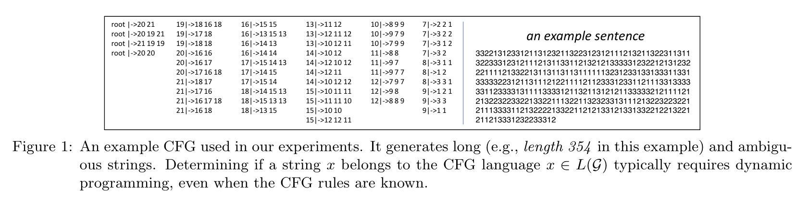
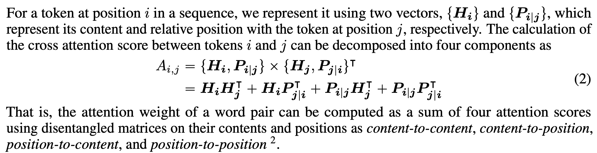
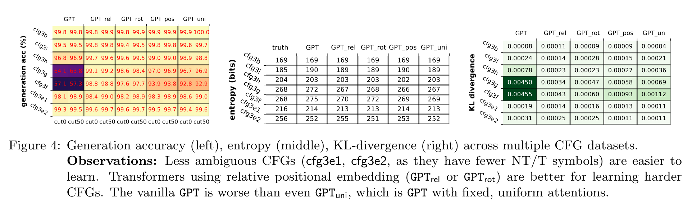
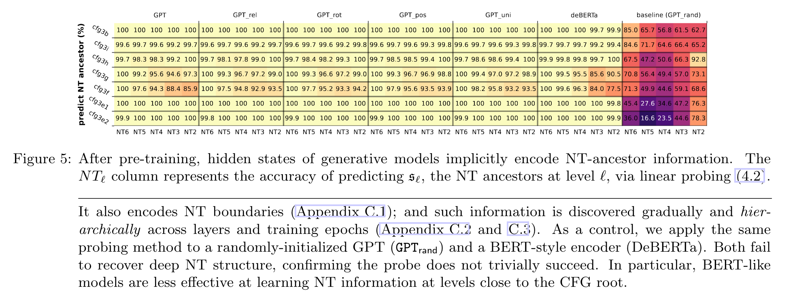
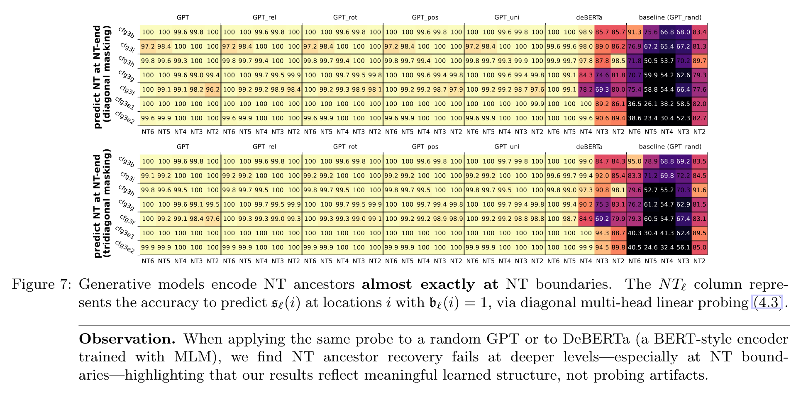

## Paper List:
1. [Physics of Language Models: Part 1, Learning Hierarchical Language Structures](https://arxiv.org/abs/2305.13673)
2. [Physics of Language Models: Part 2.1, Grade-School Math and the Hidden Reasoning Process](https://openreview.net/forum?id=Tn5B6Udq3E)
3. [Physics of Language Models: Part 2.2, How to Learn From Mistakes on Grade-School Math Problems](https://arxiv.org/abs/2408.16293)
4. [Physics of Language Models: Part 3.1, Knowledge Storage and Extraction](https://arxiv.org/abs/2309.14316)
5. [Physics of Language Models: Part 3.2, Knowledge Manipulation](https://arxiv.org/abs/2309.14402)
6. [Physics of Language Models: Part 3.3, Knowledge Capacity Scaling Laws](https://arxiv.org/abs/2404.05405)
7. [Physics of Language Models: Part 4.1, Architecture Design and the Magic of Canon Layers.](https://ssrn.com/abstract=5240330)

# Physics of Language Models: Part 1, Learning Hierarchical Language Structures
LLM的reasoning mechanism一直是一个热议话题，先前工作主要做copy/selection这样的simple symbolic tasks，本文探讨一个更难的task：context-free grammars (CFGs).

最终能够得到以下insights：
* 为何绝对位置编码（Absolute PEs）劣于旋转形式的相对位置编码（relative and rotary PEs，这里指的应该就是RoPE）
* uniform attention很强了
* encoder-only的模型在CFG的deep structure reasoning层面劣于auto-regressive模型
* 在与训练数据中注入structural or syntactic noise显著提升模型在corrupted prompts上的鲁棒性

## Previous Work and Their Claims
1. **A Simple Case**: attention head可以做括号匹配（Can transformers learn to solve problems recursively?）
2. **知识存储**：transformer的MLP层存了一些key-value形式的知识（ROME，MEMIT等工作）
3. **Induction Heads**：
   * transformer有一些头能存一些更为抽象的feature，而不只是token层面的matching 
   > They “hypothesized” that induction heads may exist to “match and copy more abstract and sophisticated linguistic features, rather than precise tokens”, yet they acknowledge that they “don’t have a strong framework for mechanistically understanding” this.
4. **一些关于logical reasoning的reverse engineering**：提出了不同功能的attention heads
   > Most notably, they explained how GPT2 predicts the next token “Mary” given prefix “When Mary and John went to the store, John gave a drink to [...]” This requires some logical reasoning by selecting (not naively copying) what is the right name. 

## Motivation
目前模型已经很强了，我们往往实际上关心的是一些非常难的reasoning tasks，可能背后没有很好的algotirhm，不像之前研究的类似copy，selection，sorting这样的tasks。那我们能否提出一个setting去研究更为复杂的任务？
* 希望能够捕捉到长程dependency
* 希望有一些local ambiguity，希望找一些CFG是需要global planning

## Preliminaries
* synthetic CFGs, 作者创建了一套比较复杂的CFG规则。
  * 在这种情况下，判断一个句子是否符合这段语法是比较困难的，需要用DP之类的思想。
  * 且保证要有local ambiguous，使得模型不太能有shortcut
  * 语法树深度可以被扩展得很深
    

## Main Conclusions
### Results 1-3: Transformers can learn such CFGs
* GPT这种架构可以学会CFG
* 用rotatary或relative attention是很必要的，尤其对于比较复杂的CFG而言
* 通过attention pattern或者hidden states给出一些解释
#### evidence
作者在上述CFG上generate了一个符合语法规范的large corpus，并在上面pretrain了一个decoder-only transformer。把每一个termial token作为一个separate token。

实验的模型为GPT2-small(12-layer, 12-head, 768-dimensions)，利用以下PE：
1. $\text{GPT}_{rel}$: 使用如下的相对位置编码，在hidden state上concat**相对位置编码** for attention的计算
   * 
2. $\text{GPT}_{rot}$: 用RoPE
3. $\text{GPT}_{pos}$: 把attention matrix直接替换成$A_{i,j}$仅依赖于$i,j$相对位置的形式，但这个$A_{i,j}=f(i,j)$是可以训的
4. $\text{GPT}_{uni}$：用fix住的attention matrix，第h个头用uniform average over the previous $2^h-1$个token（？什么意思）

以上模型，除了原始的GPT（用的绝对位置编码）都可以学到synthetic CFG，给出任意前缀，均可生成completion strings满足以下要求：
* **accuracy**: 满足CFG rules
* **diversity**: 在CFG language中满足一定的多样性
* **probability**: distribution上满足CFG生成时的分布

💭：这里模型的泛化性如何界定？特别是能否界定模型学到了哪一个hierachy的rule？test sample中的sequence是否没有出现在过pretraining corpus中？

实验结果如下：

1. 左图展示了不同GPT在不同难度的CFG上的test accuracy，其中cut0表示prompt sequence length为0，cut50表示prompt sequence length为50。
2. 中间的图展示了模型的生成多样性，作者认为，生成多样性说明了模型并不是在预训练时仅仅记住了CFG的一个subset。
3. 右图展示了和true CFG distribution的KL divergence。

💭：同样地，是否依赖memorization感觉目前的证据并不充分。可以做一些干预实验，比如在pre-training corpus里面去掉某个pattern，看模型是否仍然能学会。

### Results 4-5: How do transformers learn CFGs?
* 用multi-head linear probe说明模型的hidden states中存了NT（nonterminal）的信息
* 而BERT这样的架构学不到

#### evidence
**Multi-head Linear Probe.** 在Transformer最后一层，做multi-head linear probe,对不同的头训不同的linear head，最后用可训练head weight加起来。

linear probe说明GPT models可以在最后一层encode进NT ancestor和NT boundary的信息：

💭：最后一层probe出来，这对于result 1-3（模型可以学到CFG的distribution）之外有新的信息量吗？换句话说，最后的next token prediction就是根据最后一层hidden state做的，里面一定有distribution的信息，那根据distribution是否可以直接预测ancestor，而这并不说明模型内部是有一棵CFG tree的。

### Results 6-9
* 用一些方法可视化/量化attention pattern
* 说明GPT可以学position-based和boundary-based attentions
* 对GPT如何做这种hierarchical
### Result 11
* 只在正确样例上做训练的GPT robustness较差
* 加10%的perbutation可以大幅提升模型鲁棒性
* -->在预训练阶段加稍微差一点的数据可能有好处
### Result 12-13
* GPT会发展出一种模式开关，在是否会犯语法错误上做出转换

