# Reasoning Beyond Language: A Comprehensive Survey on Latent Chain-of-Thought Reasoning

## Taxonomy

* methodological advances
  * **token-wise strategies**
    * discrete tokens
    * continuous tokens
  * **Internal mechanisms**
    * structural forms
    * representational forms
* analysis and interpretability
* applications

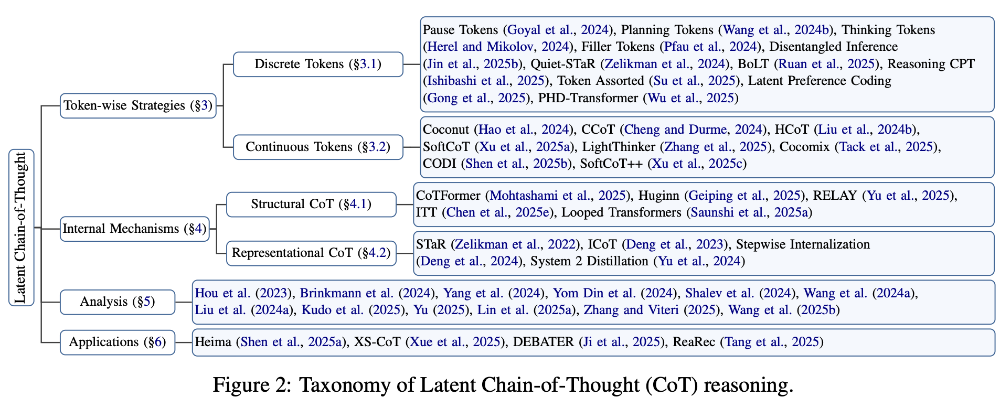

## Token-wise strategies

### Discrete tokens

* Pause Tokens (Goyal et al., ICLR 2024)
  * 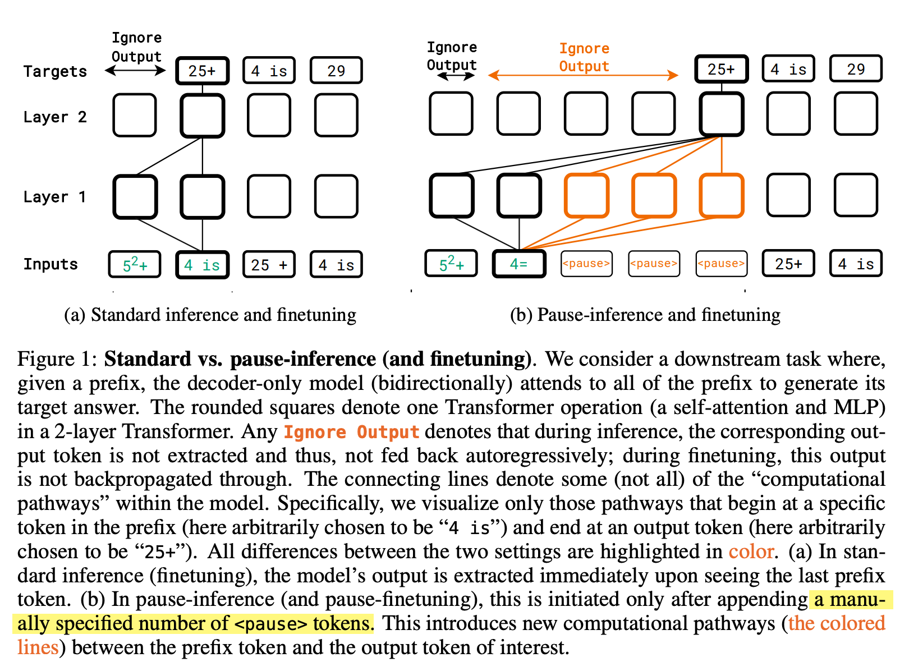
  * pretraining: 在文本中随机插入pause token，不算pause token上的loss 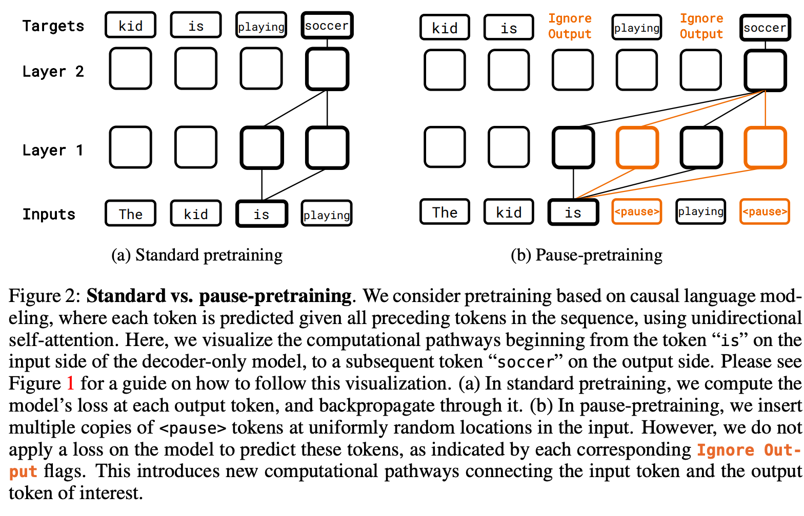
  * 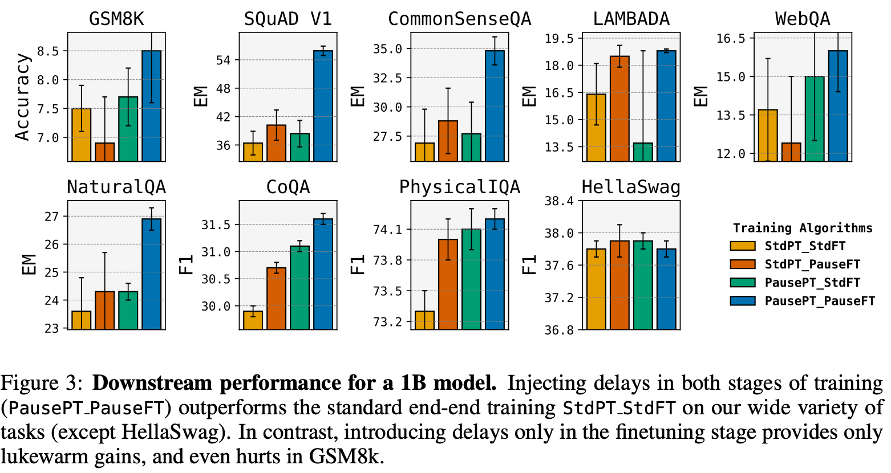
  * ablations: 在finetune的时候加多少pause token是认为给定的，这里对这个数量做了ablation (figure 4b)；figure 4c中表示出训M个pause token，在inference中略微改变pause个数，性能不会差太远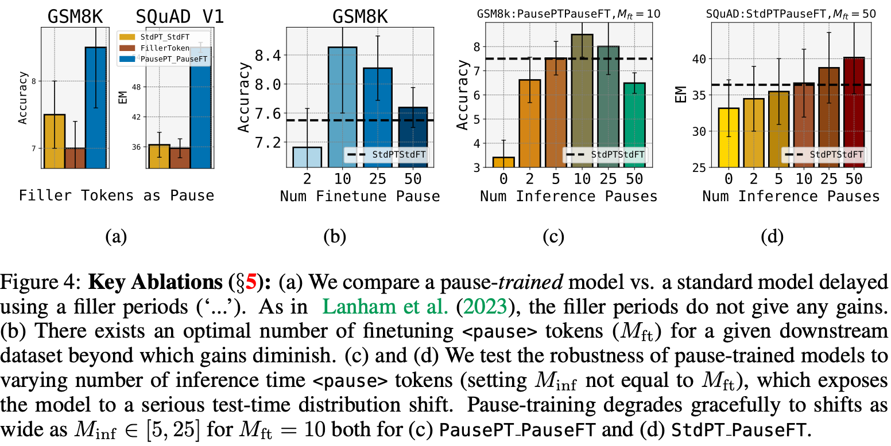
* Planning Tokens (Wang et al., 2024),
  * the token embedding that can be dynamically captured instead of manually assigned
  * 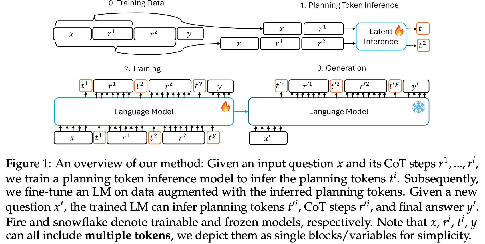
* Token Assorted (Su et al., 2025)
  * employed vector-quantized VAEs
    (VQ-VAEs) to condense reasoning steps into discrete latent tokens, reducing computational costs while maintaining performance.
  * 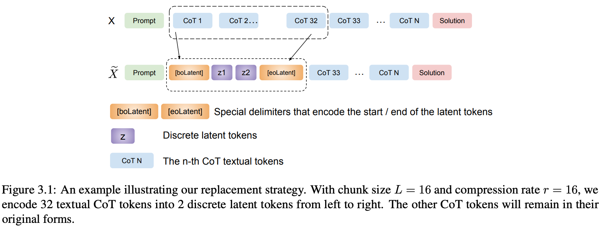

### Continuous tokens

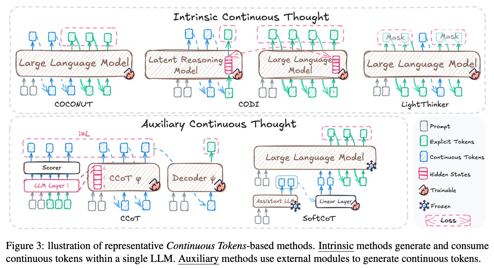

* COCONUT
  * 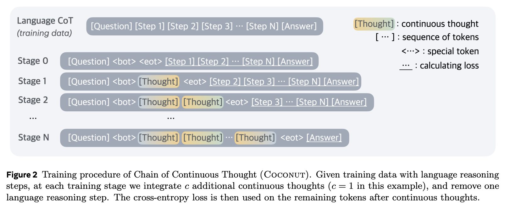
* CODI
  * 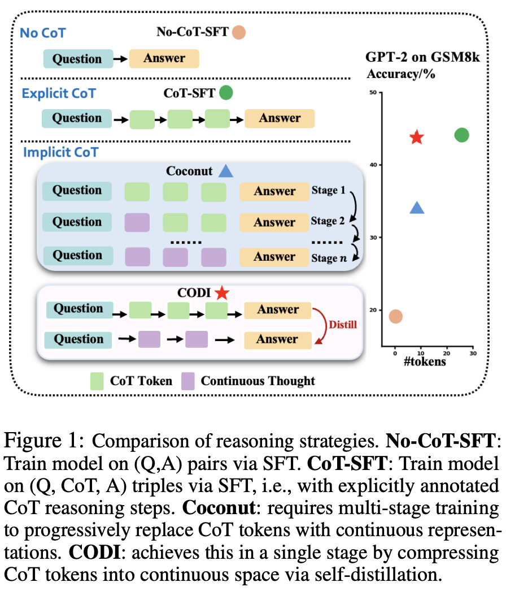
  * 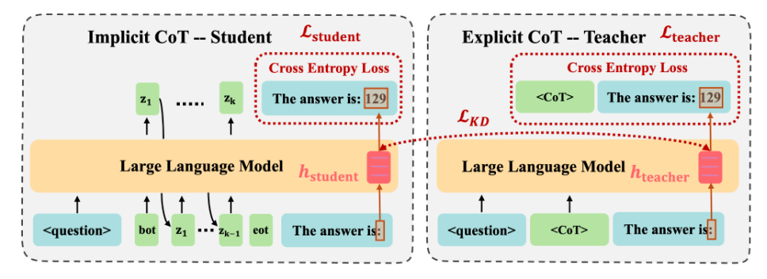

# A Survey on Latent Reasoning

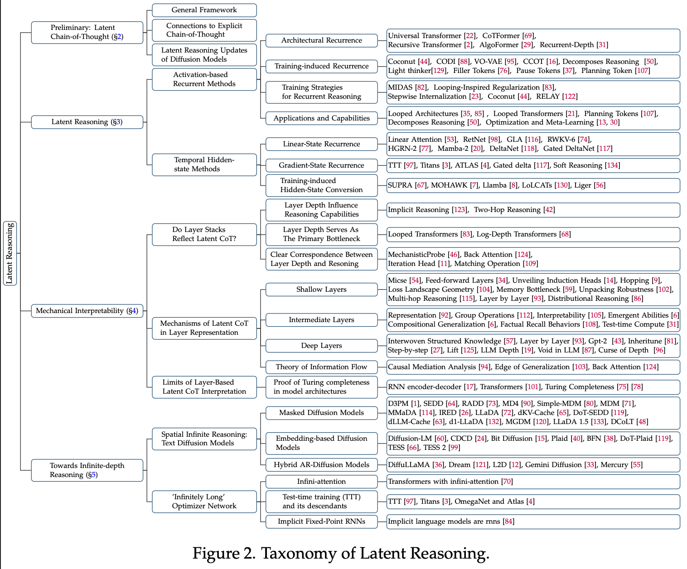

## Latent Reasoning

作者总体分为vertical recurrence: activation-based methods和horizontal recurrence: hidden state-based methods

### 1. Activation-based Recurrent Method

#### 1.1 Loop/Universal Transformer Recurrence

Loop/Universal transformer recurrence：通过architecture上的改动，使得一次前向可以包含多层的recurrence。

* **initial work**
  * universal transformer (2018)
    * 有一个机制控制循环几次
    * **Adaptive Computation Time** to control compute step for each token independently $\Rightarrow$ 每个position的ACT是独立的，如果某个position a在t时刻被停止了，$h_a^t$会被一直复制到最后一个position停止
    * The key innovation lies in treating network depth not as a static hyperparameter but as a dynamic computational resource that can be allocated based on task complexity
  * Pondering LM (2025.6)
    * 有点像Jacobi decoding
    * 一次前向，用输出的probability对token embedding加权，作为下一轮输入，再迭代几轮
    * 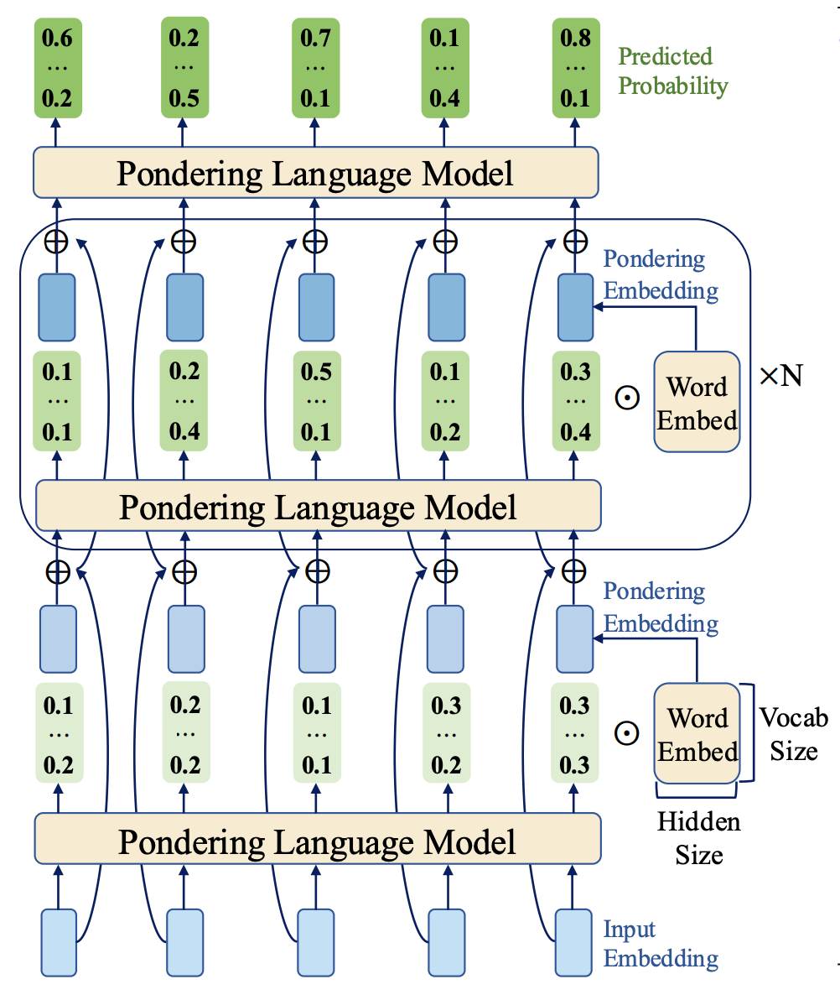
* **some evolution trend**
  * **逐渐模块化**：The Rise of Pre/Loop/Coda Structure
    * Universal Transformer and CoTFormer 没有特别的stage的区分，都是统一的recurrent的架构
      * CoTFormer:把之前的token append直接append到输出token前（2 vectors for a same token）
        * 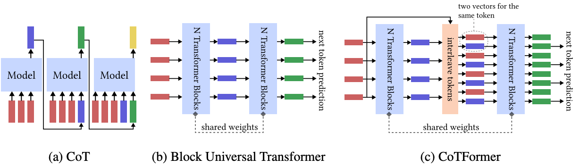
    * 之后逐渐区分出Pre/Loop/Coda的structure
  * **每个模型中per-iteration的input会有区别**：
    * 给上一层的output
    * 给上一层的output+depth embeddng（Universal Transformer）
    * 给上一层的output和第一层的embedding
  * **depth embedding逐渐消退**
  * **dynamic stopping机制逐渐简化**
    * 从一开始universal transformer的ACT（算cumulative probability）到CoTFormer的MoR router，之后基本类似于不动点迭代

#### 1.2 Activation with Explicit Hidden-State Feedback

While loop-based architectures refine token representations by rerunning the same set of layers,
a distinct family of models *feeds hidden states back into the input stream* between iterations.

In these systems the *hidden activations themselves become new sequence elements*, so each recurrent
step simultaneously extends the effective depth and exposes internal computation to subsequent
attention.

* COCONUT
  * 
* CoTFormer

和上面的Universal Transformer的不同之处：

* 会重新把hidden vector当作token输进去（sequence随着每次过前向会变长）, bridging vertical recurrence and horizontal memory
* no architectural expansion—the model reuses
  the same layers so parameter count stays constant while depth grows dynamically
* latent reasoning remains internal, thereby avoiding the latency of producing explicit CoT tokens

#### 1.3 Training-induced Recurrence

不用做architectural改进

* core principal: create implicit loops in the computation graph
  1. continuous recurrence: 把activation重新喂给模型，by feeding activations back into the model
  2. compressed states: compressing multi-step reasoning into iteratively-processed representations
  3. expanded iterations: extending the effective computation depth through strategic token insertion

⭐️ the differences between architectural changes like universal transformer and adding latent tokens:

* 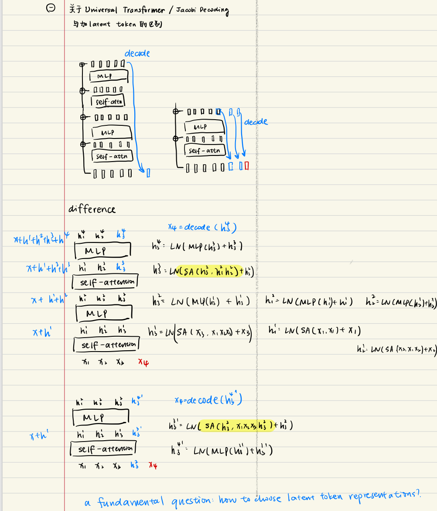
  这么看来，从表达能力上来看，上面这种universal transformer的要比加latent token的要好，因为$h_1^2, h_2^2$包含了$x_1, x_2$的信息（through residual stream）。但效率上应该要低一些？

1. Continuous Activation Recurrence
   1. Coconut: implemented entirely through training, instead of modifying the model architecture.
      * trainig process

        * at the $k$-stage, the first $k$ reasoning steps in the CoT are replaced with $k\times c$ continuous thoughts, where $c$ is a hyperparameter controlling the number of latent thoughts replacing a single language reasoning step
        * does **not** encourage the continuous thought to *compress the removed language thought*, but rather to *facilitate the prediction of future reasoning*
      * inference process

        1. train a binary classifier on latent thoughts to enable the model to autonomously decide when to terminate the latent reasoning
        2. always pad the latent thoughts to a constant length

        * ⭐️ 这里直觉上来说，是否可以用不动点迭代思想，用latent thought是否收敛来判断
   2. CoCoMix: Coconut 续作
      * 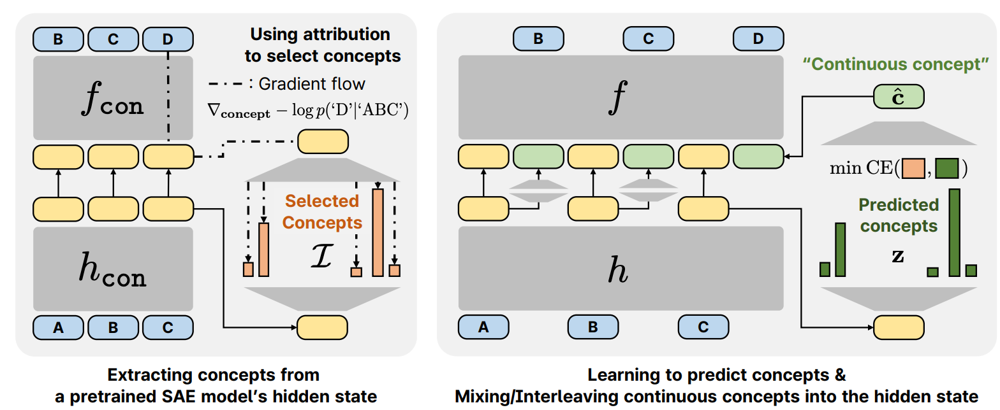
      * 用一个预训练的SAE来抽每一次前向中的influential concepts based on attribution scores
      * the model is then trained to predict these selected concepts from its hidden state using a cross entropy loss
      * model 能够 predict multiple concepts后，可以把这些压缩到一个single continuous concept然后mix or insert到hidden states中去
      * can do steering with the concepts
   3. CODI: self distillation
      * By aligning the hidden activation before the final answer between teacher (with full CoT) and student (with compressed reasoning) paths, CODI effectively learns a fixed-point iteration in activation space.
      * more stable than coconut's curriculum learning
      * 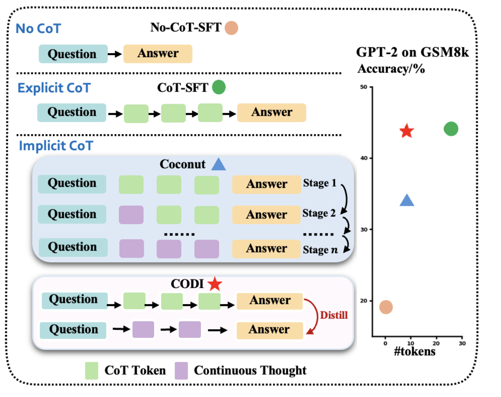
   4. CCOT: variable lengths
      * 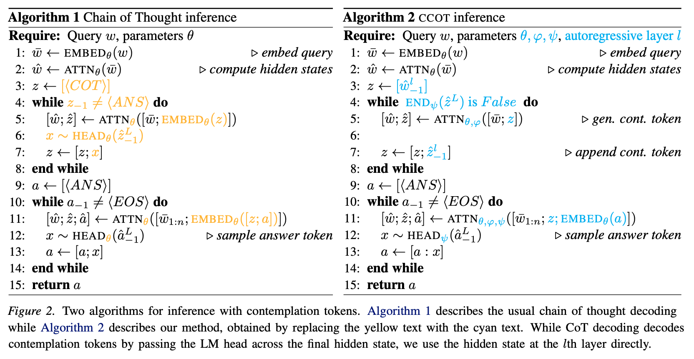
   5. PCCOT: Jacobi-iteration allowing parallel continuous thoughts
   6. System-1.5 Reasoning
      * 不止省token，也省层深的latent reasoning 
      * 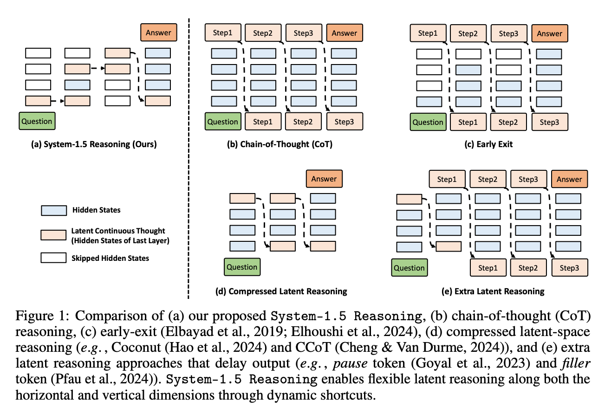
2. Compressed State Recurrence: compress reasoning steps into discrete / semi-discrete tokens
   1. Token Assorted
      * 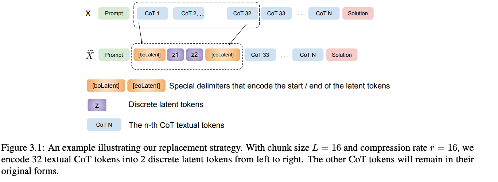
   2. gist tokens 
3. Iteration Expansion through Strategic Tokens
   1. Filler Token: Pfau et al. demonstrate that even meaningless filler tokens (e.g., "......")
   2. Pause Token: Goyal et al. refine this with learnable `<pause>` tokens that explicitly signal computation steps
   3. More sophisticated approaches inject structured tokens that organize the recurrence pattern，比如加入类似：`<memory>`, `<reason>`

#### 1.4 Training Strategies for Recurrent Reasoning
* for architectural recurrence
  * MIDAS proposes a progressive stacking framework to address training stability in loop-based models. It defines a replication operator $M(f, b)$ that duplicates the middle layers of a base model $f$ by a factor $b$, enabling gradual depth expansion.
* for training-induced recurrence
  * Stepwise Internalization pioneered curriculum-based compression of reasoning traces. This technique gradually removes CoT tokens during finetuning, allowing models to internalize reasoning patterns into their parameters. $\Rightarrow$ curriculum learning adopted by Coconut
---
### 2. Temporal Hidden-state Methods
discuss models like RNN, mamba... not my main focus, maybe fill here someday.

---
## Mechanistic Interpretability
### 1. Do Layer Stacks Reflect Latent CoT?
conclusions:
* generally, layer depth serves as the primary bottleneck for latent reasoning capacity
* At a micro level, studies commonly reveal a clear correspondence between specific layers and tasks within CoT reasoning

### 2. Mechanisms of Latent CoT in Layer Representation
* Shallow Layers: Basic representational processor of Latent CoT
* Intermediate Layers: Core of Latent CoT
  * Intermediate layers contain specific, identifiable computational sub-circuits specialized for distinct reasoning sub-tasks
  * Intermediate layers exhibit unique characteristics in representation
  * Intermediate layers have a causal influence on final reasoning outcomes
* Deep Layers: Output Refinement and Decision-making of Latent CoT

### 3. Turing Completeness of Layer-Based Latent CoT
* Pérez et al. formally proved for the first time that the **Transformer architecture is Turing complete**, possessing the universal capability to execute any computable function. However, the validity of this proof relies on three crucial theoretical assumptions: 
  * Arbitrary Precision
  * Positional Encodings
  * Hard-Max Attention.
* Further, Li and Wang proved for the first time that Turing completeness can be achieved under constant numerical precision
* A unifying view of latent CoT and standard CoT
  * 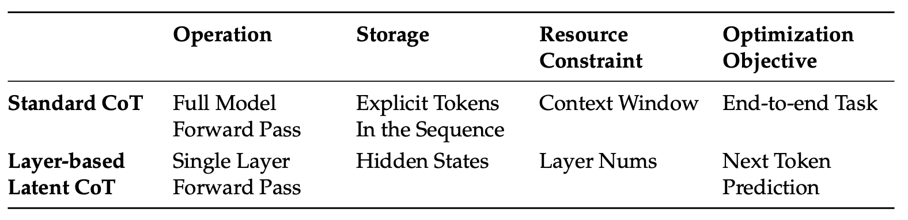

---
## Towards Infinite-depth Reasoning

to be continued