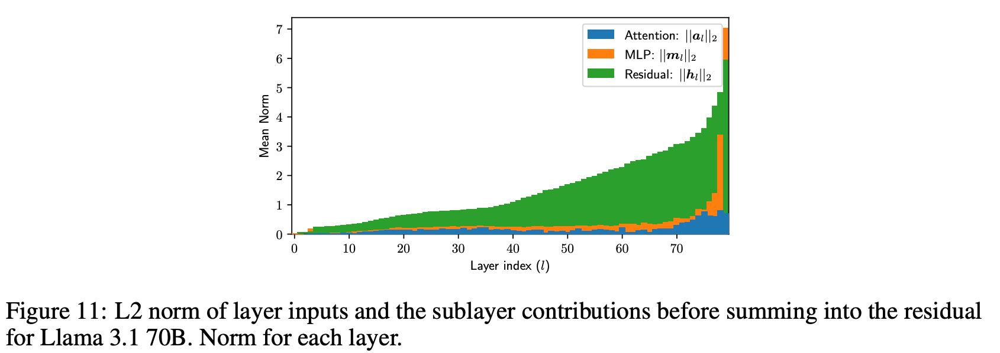

- [X] (2025.5) Hybrid Latent Reasoning via Reinforcement Learning
- [X] (2025.5) Reinforced Latent Reasoning for LLM-based Recommendation
- [X] (2025.5) Seek in the Dark: Reasoning via Test-Time Instance-Level Policy Gradient in Latent Space
- [ ] (2025.5) Think Silently, Think Fast: Dynamic Latent Compression of LLM Reasoning Chains
- [ ] (2025.7) CTRLS: Chain-of-Thought Reasoning via Latent State-Transition
- [X] (2025.5) Continuous Chain of Thought Enables Parallel Exploration and Reasoning
- [ ] (2025.5) Do language models use their depth efficiently?
- [ ] Understanding and minimising outlier features in transformer training

# Seek in the Dark: Reasoning via Test-Time Instance-Level Policy Gradient in Latent Space
*2025.5.19 BIGAI, Zilong*

* **LATENTSEEK** leverages policy gradient to iteratively update latent representations, guided by self-generated reward signal
* Test-Time Instance-Level Adaptation (TTIA) does **not** require parameter updating and operates on a *per-instance basis* during the *testing phase*


## Test-Time Instance-Level Adaptation (TTIA)
### problem formulation
auto-regressive language model $\pi$, a reasoning problem instance $c$ as context prompt:
$$
\pi(x|c) = \prod_{t=1}^{T} \pi(x_t | x_{<t}, c)
$$

at test time, the ground truth is unknown, introduce a reward function $R(x, c)$:
$$
x^* = \argmax_x R(x, c)
$$
### TTIA with policy gradient in latent space
for a given input sequence $x$, denote a corresponding sequence of latent representations $z = (z_1, z_2, \cdots, z_T)$, where $z_t\in\mathbb{R}^d$ lies in the latent space of $x_t$, 这里说的是LM head之前的最后一层hidden state。

则TTIA in the latent space的优化目标如下：
$$
z^* = \argmax_z \mathbb{E}_{x\sim\pi(x|z)}[R(x, c)]
$$

> 💭 comment: 这太奇怪了，这样language model只是encoder的作用？reasoning指望在这最后一层latent通过self modification完成？

* sampling strategy
  * 像本来的模型一样，某个位置的latent只管那个位置的token
  * $\pi(x|z) = \prod_{t=1}^T \pi(x_t|z_t)$
* optimization procedure
  * $z\leftarrow z+\eta \nabla_z \mathcal{J}(z)$
  * $\nabla_z\mathcal{J}(z) = \mathbb{E}_{x\sim\pi(x|z)}[R(x, c)\nabla_z \log\pi(x|z)]$
* reward function
  * latent space $\rightarrow$ greedy decoding $\rightarrow$ self-reward prompt + pretrained language model $\rightarrow$ compute the reward
  * $R(x, c)\sim \pi(\cdot|\tilde{x}, c, \text{prompt}_{\text{self-reward}})$

总体思想：用LLM的self-reward当reward function来优化最后一层的hidden state，像一个较为华丽的self-verification+self-consistency

### performance
应该保持BoN和LATENTSEEK iteration数相同的：


# Hybrid Latent Reasoning via Reinforcement Learning
2025.5.24 UIUC

* introduce hybrid reasoning policy optimization (HRPO), an RL-based hybrid latent reasoning approach that 
  * (1) integrates prior hidden states into sampled tokens with a learnable gating mechanism
  * (2) initializes training with predominantly token embeddings while progressively incorporating more hidden features

## Methods
* 把最后一层hidden states对token embedding做加权和token embedding加起来，然后做正常的RL。
* 有一个gating机制决定hidden state和sampled token's token embedding的占比


## Performance


# Reinforced Latent Reasoning for LLM-based Recommendation
* discuss applications in reconmmendation system
* two-stage strategy:
  * first, supervised finetuning to initialize the latent reasoning module
  * second, pure RL training to encourage exploration through a rule-based reward design
* add an attention layer on top of the LLM's final decoding layer $\rightarrow$ extracts information from the final hidden states of the LLM to generate a latent reasoning token aligned with the LLM's input embedding space

> 💭 为什么是一个attention层？

## Latent reasoning architecture

1. introduce an additional attention layer on top of the final decoding layer to explicitly generate latent thought tokens
   1. dedicated reasoning generator that aggregates contextual information?
   2. ensure the generated tokens are aligned with the LLM's input embedding space
2. 定长latent token

# :star: Continuous Chain of Thought Enables Parallel Exploration and Reasoning
* continuously-valued tokens
(CoT2) 
  * examines the benefits of CoT2 through logical reasoning tasks that inherently require search capabilities 
  * provide optimization and exploration methods for CoT2
* interpretability
  * CoT2 allows the model to track multiple traces in parallel and quantify its benefits for inference efficiency
  * one layer transformer equipped with CoT2 can provably solve the combinatorial "subset sum problem"
* several sampling strategies:
  1. samples and composes $K$ discrete tokens ar each decoding step to control the level of parallelism (reduce to standard CoT when $K=1$)
  2. continuous exploration over the probability simplex
  3. policy optimization with CoT2 indeed inproves the performance of the model beyond its initial discrete and continuous supervision

## Introduction
Motivation:
1. modern language models may not fully utilize their potential for a few reasons:
   1. discrete sampling of tokens limits the model to emitting at most $\log_2(v)$ ($v$ is the size of vocabulary) bits per sample, or more specifically, the Shannon entropy of the softmax output. This contrasts with the $O(d)$ bits each token embedding can store
   2. Secondly, discrete sampling can cause the model to commit to certain solutions and avoid exploring alternatives 

Method: CoT with Continuous Tokens (CoT2), built on COCONUT
* rather than the model sampling a single token from the vocabulary, it samples or deterministically *selects a continuous superposition of tokens according to the softmax output*

Contributions:
* Mechanistic and theoretical study of CoT2
  * theoretical: single-layer transformer can solve Minimum Non-Negative Sum (MNNS) using CoT2
  * theoretical study for:
    * **Base CoT2**: deterministic inference which creates and feeds continuous tokens using full softmax output at each step
    * **CoT2-MTS (multi-token sampling)**: samples $K$ discrete tokens from softmax and averages them to form a continuous token (maybe like top-k version of Base CoT2)
* Supervision and reinforcement for CoT2
    * distill, like distill multiple CoT traces into CoT2 continuous tokens
    * policy optimization


## Problem Setup
Objective: given $X\in\mathbb{R}^{n\times d}$, where each of the $n$ rows is a d-dimensional embedding vector, the objective is to output $m$ tokens where the $m^{th}$ token to be the final answer.

除了final answer，前$m-1$个token均为continuous：
For the first $m-1$ steps, the model outputs continuous tokens $\{z_t\}_{t\in [m-1]}$, at the final step $t=m$, the model outputs a discrete token $z_m$ from a vocabulary of size $v$.

对于$1\leq t\leq m-1$, the model outputs the following probability distribution over $v$ vocabulary entries via a softmax operation:
$$
LM_{\theta}(\cdot|z_{<t}, X):=\alpha_t
$$

$$
z_t = E^\top \alpha_t\in\mathbb{R}^d
$$

where $E$ is the embedding matrix $E = [e_1, \cdots, e_v]^\top\in \mathbb{R}^{v\times d}$

### CSFT: A Supervised Training Method for CoT2
supervise at each token, specify a target probability distribution:
$$
\alpha_t^* = [\alpha_{t,1}^*, \cdots, \alpha_{t, v}^*]
$$

train the model to minimize the cross entropy between model output and this distribution

2 ways to provide prefix:
1. use ground truth prefix
2. use previous generated continuous tokens

latent token数目固定
### Reinforcement Learning Methods for CoT2


# Think Silently, Think Fast: Dynamic Latent Compression of LLM Reasoning Chains


## overview
* 2-stage training approach
  * SFT: next-token prediction by incorporating an auxiliary next compressed embedding prediction objective
  * RL
* perform reasoning at a dense latent level; dynamically adjust reasoning speed

## motivation regarding previous attempts
1. regarding efficiency work about long-CoT
   1. enhancing efficiency at the token level, primarily by identifying and skipping less informative tokens
   2. prompting models to generate more concise reasoning steps
   3. dynamically terminating reasoning when the model exhibits high confidence in a trial answer
2. regarding latent CoT
   1. Initial efforts attempt to “internalize” reasoning knowledge by curriculum learning or knowledge distillation
   2. Some works focus on the potential inside LLMs by looping or skipping some intermediate LLM layers
   3. Recent innovations have introduced auto-regressive prediction of latent representations for efficient reasoning
```
limitations:
1. fixed-length reasoning chains
2. use deterministic latent reasoning processes
```

## method


* utilize an auxiliary next compressed embedding prediction task in SFT stage
  * at each training step, CoLaR first samples a random compression factor $c\in[1, c_{max}]$ and merges the embeddings of $c$

1. Reasoning token compression and understanding
   1. 根据compression rate，begin each training step by randomly sampling $c\in[1, r_{max}]$, for every $r$ consecutive reasoning token embeddings $e_{r}^{k:k+r}$, the embedding compress module generates a compressed embedding $e_c^k$
   2. embedding compress module: 
      1. apply mean pooling: 
         * Simply averaging these embeddings can distort the original distribution. 
         * For instance, consider two uncorrelated distributions $A\sim N(\mu, \sigma^2)$, $B\sim N(\mu, \sigma^2)$
         * mean pooling would alter the original distribution to $\frac{A+B}{2}$, effectively scaling the variance by $\frac{1}{2}$. We found that, for most pre-trained LLMs, the distributions of embeddings are centered at $\mu\approx 0$. Thus, to prevent distortion of the original embedding distribution of LLMs, the Embedding Compress module only scales the sum of the $r$ embeddings by $\frac{1}{\sqrt{r}}$
   3. 怎么给loss
      1. 只通过answer来给不佳，监督太稀疏了没法收敛
      2. train一个model来predict compressed reasoning token, for each compressed token embedding, CoLaR should be able to **read** and **predict** tokens in groups of *r*.
    $$
    \mathcal{L}_{\text{comp}} = -\frac{1}{L_a+L_c}\sum\limits_{i=1}^{L_a+L_c} \log p([\textbf{t}_c, \textbf{t}_a]^i)
    $$
2. Next compressed embedding prediction
   1. explore in the latent space $\rightarrow$ given the current hidden states $h_c^i$ output by $\mathcal{M}$, the latent head $\mathcal{E}$ predicts both the mean $\mu_c^{i+1}$ and the standard deviation $\sigma_c^{i+1}$ of the next embedding's distribution $\rightarrow$ $e_c^{i+1}=\mu_c^{i+1}+\sigma_c^{i+1}\epsilon$
   2. the latent head is primarily trained using the negative log-likelihood loss, for a prediction at position $i$, this can be formulated as:
   $$
    \mathcal{L}_{\text{latent}}(i) = -\log p(e_c^i|\mu_c^i, \sigma_c^i) = \frac{(e_c^i-\mu_c^i)^2}{2\sigma_c^i}+\log \sigma_c^i
   $$

   3. we empirically found that CoLaR with NLL loss tends to under-fit on simpler math reasoning datasets that require less exploratio $\rightarrow$ propose a soft-MSE loss that combines Mean Squared Error with an entropy regularization term
   $$
    \mathcal{L}_{\text{latent}}(i) = \mathbb{E}_\epsilon [(\mu_c^i+\sigma_c^i \epsilon -e_c^i)^2] - \alpha \left(\frac{1}{2}\log (2\pi e (\sigma_c^i)^2)\right)
   $$

3. Exploration with reinforcement learning
   1. use GRPO

## Performance
* use Llama-3.2-1B


<!-- # CTRLS: Chain-of-Thought Reasoning via Latent State-Transition -->

# Do language models use their depth efficiently?

## Motivation
Modern LLMs are increasingly deep, and depth correlates with performance, albeit with diminishing returns. However, do these models use their depth efficiently? Do they compose more features to create higher-order computations that are impossible in shallow models, or do they merely spread the same kinds of computation out over more layers?

* analyze the residual stream of Llama-3.1 & Qwen 3 family of models
* results:
  1. compare the output of the sublayers to the residual stream reveals that layers in the second half contribute much less than those in the first half, **with a clear phase transition**
  2. skip layers in the second half has a much smaller effect on future computations and output predictions
  3. for multi-hop tasks, we are unable to find evidence that models are using increased depth to compose subresults in examples involving many hops
  4. we seek to directly address whether deeper models are using their additional layers to perform new kinds of computation
     1.  train linear maps from the residual stream of a shallow model to a deeper one. We find that layers with the same relative depth map best to each other, suggesting that the **larger model simply spreads the same computations out over its many layers**.

All this evidence suggests that deeper models are **not** using their depth to learn new kinds of computation, but only **using the greater depth to perform more fine-grained adjustments to the residual**.

## more fine-grained motivation
* 一方面，之前很多工作发现，对layer做pruning不会损伤模型性能；实验上，d Gromov et al. were able to remove half of the layers from the network without significantly affecting performance on MMLU (but not for math)
* 另一方面，可解释性研究发现模型不同层确实在做不同的操作

本文的核心问题：**do deeper LLMs
use their depth to compose more features to create higher-order computations that are impossible
in shallow models, or do they merely spread the same kinds of computation out over more layers?**


## Methods
* 模型主要用：Llama-3.1-70B
* 可解释性repo：NDIF and NNsight
### 1. How do the Layers Interact With the Residual Stream?
因为所有Transformer中跟residual stream的互动都是additive的，所以可预期的是，$||h_l||_2$会随layer增长而增长。
* residual growth在outlier feature和universal transformer中都有被观察到过。

在初始时，$||a_l||_2$和$||m_l||_2$在期望意义下时一样的，as input都做了normalization。因此，later layer相比earlier layers对residual的贡献减少：改变residual方向更难。

><font color=yellow>为什么later layer贡献更少？</font>

> 因为norm逐层变大，而$||a_l||_2$和$||m_l||_2$期望不变，则是一个较小的数加到一个较大的数上去，然后再做norm，故影响逐层变小

训练时，模型可以通过在later layer增加weight norm来补偿这种residual贡献减少的趋势。然而，训练时加了weight decay，所以这种compensate又会被抑制。

此处，作者想通过residual growth的角度来看每一层的贡献度。

1. the relative contribution of sub layers.
   * $||h_l||_2, ||a_l||_2$和$||m_l||_2$ 随层的变化如下图：
     * 
   * relative contribution of each (sub)layer ($\frac{||a_l+m_l||_2}{||h_l||}$, $\frac{||a_l||_2}{||h_l||_2}$ and $\frac{||m_l||_2}{||h_l+a_l||_2}$)
     * 对后面层的影响在中间layer的时候突然下降，last few layers影响又上升
     * 
2. the cosine similarity between the residual and sublayer contributions
   1. $\text{cossim}(m_l+a_l,h_l)$
   2. Where features are orthogonal to each other, zero cosine similarity corresponds to writing a new feature to the residual, **negative values correspond to erasing features**, and **positive values mean strengthening an existing feature**.
   3. 后面的层和residual保持相似方向，

### 2. How do the Layers Influence Downstream Computations?

* Causal intervention for measuring the layers’ importance for the downstream computation
  * first, we run a prompt through the model and log the residual $h_l$
  * second, we run the same prompt again, but this time, we skip layer $s$m by setting $\overline{h}_{s+1}:={h}_{s}$, and we log the intervened model model $\overline{h}_l$
  * third, we measure the relative change in the contribution of layer $l>s:\frac{||(h_{l+1}-h_l)-(\overline{h}_{l+1}-\overline{h}_l)||}{||h_{l+1}-h_l||_2}$
  * 
* Measuring layer importance for future predictions
  * measure the effect on the future tokens when skipping layers for earlier tokens. We do this by sampling a position $1 < t_s < T − 1$, skipping the layer only for token positions $t \leq t_s$, and measuring the effect only on positions $t > t_s$.
* apply logitlens to the middle-layer hidden states $\rightarrow$ 
  * the prediction refinement seems to start at the same position at the same phase transition as when the layers do not influence the future predictions anymore, where the cosine similarities change sign, and the layer’s importance decreases
  * 

### 3. Do Deeper Problems Use Deeper Computation?

We expect that:
1. transformers use more layers to do deeper computation;
2.  later steps of a composite computation should be executed in later layers, so that they can receive the results of earlier subproblems as inputs

but do models really orgnanize their computations this way?

* **Residual erasure interventions**:
  1. integrated gradients: compute the gradient on all answer tokens, but not on the prompt
  2. maximum prediction norm change: 

* **The Depth Score**:
  1. 