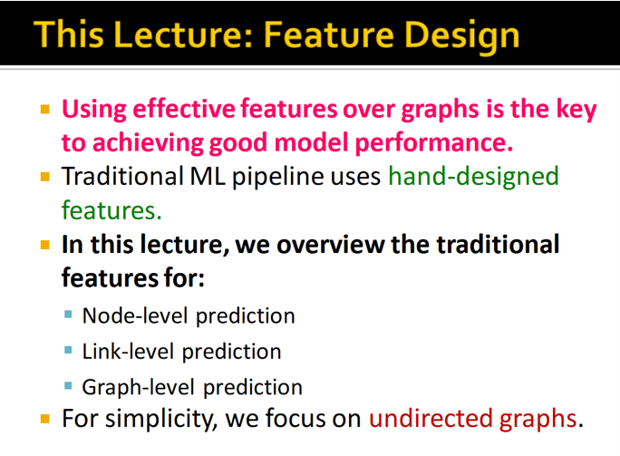
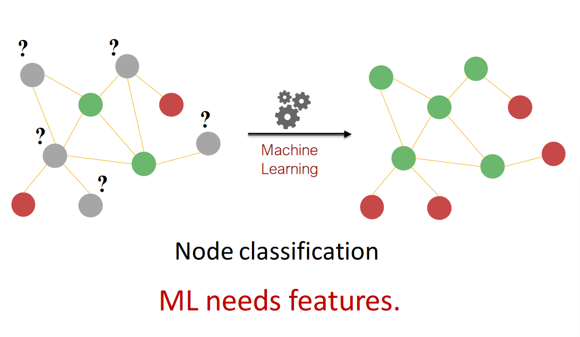
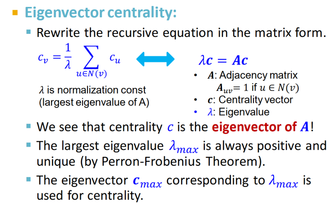

@import "https://haogeshuohuanihaohaoting.github.io/static/mdCreateMenu.js"

<head>

</head>
<head>
    
    
</head>

# lecture 2: traditional feature-based method

## overview
### traditional ML pipeline
* Design features for nodes/links/graphs 设计node/link/graph level的特征
* Obtain features for all training data 获得这些特征
### 这个 lecture 讲什么：
传统的 ML 用的都是一些 handcrafted feature，这节课就讲这些features。

* 注意这些feature的类型和任务类型是对应的
  * node feature - node prediction
  * link feature - link prediction
  * graph feature - graph prediction

## 2.1 NODE -level tasks and features

### 2.1.1 overview
**Goal**: Characterize the structure and position of a node in the network:
* Node degree
* Node centrality
* Clustering coefficient
* Graphlets
### 2.1.2 node degree $d_v$
* 有多少条边（邻居节点）。
在 self-loop 和 multi-graph 上这个概念比较tricky

* neighbour 之间不做区分

### 2.1.3 node centrality $c_v$
* centrality $c_v$ 同时把 node importance 考虑进来
* Different ways to model importance:
  * Engienvector centrality
  * Betweenness centrality
  * Closeness centrality
  * and many others...
#### node centrality (1)

## LINK
## GRAPH
