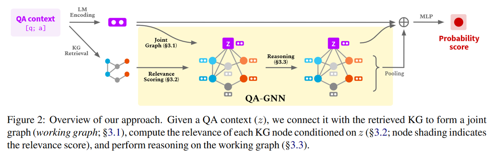
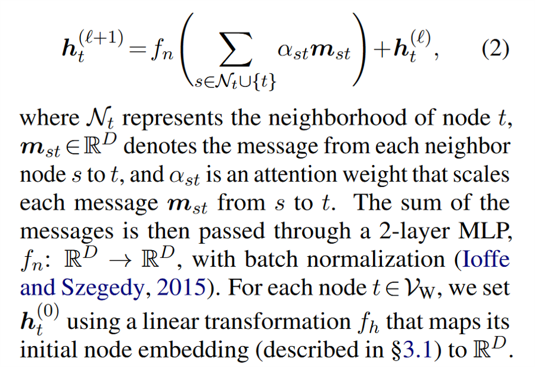

<head>

</head>
<head>
    
    
</head>

- [0. Abstract](#0-abstract)
  - [- challenge](#--challenge)
  - [- key innovations of QA-GNN](#--key-innovations-of-qa-gnn)
- [1. Introduction](#1-introduction)
  - [QA must be able to reason over relevant knowledge](#qa-must-be-able-to-reason-over-relevant-knowledge)
  - [challenges of combining LM and KG](#challenges-of-combining-lm-and-kg)
  - [limitations of previous work](#limitations-of-previous-work)
  - [QA-GNN](#qa-gnn)
- [2. Problem statement](#2-problem-statement)
- [3. Approach: QA-GNN](#3-approach-qa-gnn)
  - [3.1 Joint graph representation](#31-joint-graph-representation)
  - [3.2 KG node relevance scoring](#32-kg-node-relevance-scoring)
  - [3.3 GNN architecture](#33-gnn-architecture)
    - [Node type \& relation-aware message](#node-type--relation-aware-message)
    - [Node type, relation, and score-aware attention](#node-type-relation-and-score-aware-attention)
  - [3.4 Inference \& Learning](#34-inference--learning)

# 0. Abstract
## - challenge
methods need to
1. identify relevant knowledge from large KGs
2. perform joint reasoning over the QA context and KG
## - key innovations of QA-GNN
1. relevance scoring
   use LMs to estimate the importance of KG nodes relative to the given QA context
2. joint reasoning
   connect the QA context and KG to form a **joint graph**, and mutually update their representations

# 1. Introduction
## QA must be able to reason over relevant knowledge
* knowledge can be **implicitly** encoded in large language models (LMs) pre-trained on unstructured text
* knowledge can be explicitly represented in structured knowledge graphs
* LM pros and cons:
    * 单纯用 LM 来做 QA 有一些好的结果 --> broad coverage of knowledge

    `roberta: A robustly optimized bert pretraining approach.`

    `Exploring the limits of transfer learning with a unified text-to-text transformer.`

    * not good at structured reasoning(bad at negation `Negated and Misprimed Probes for Pretrained Language Models: Birds Can Talk, But Cannot Fly`)

* KG pros and cons:
  * pros:
    * more suited for structured reasoning
    * enable explainable predictions
  * cons:
    * lack coverage and be noisy

## challenges of combining LM and KG
1. identify informative knowledge from a large KG
2. capture the nuance of the QA context and the structure of the KGs to perform joint reasoning over these two sources of information

## limitations of previous work
1. Previous works **retrieve a subgraph** from the KG by taking topic entities (KG entities mentioned in the given QA context) and their few-hop neighbors.

    this introduces many entity nodes that are semantically irrelevant to the QA context, especially when the number of topic entities or hops increases.

2. existing LM+KG methods for reasoning treat the QA context and KG as two **separate** modalities

## QA-GNN
1. relevance scoring
    score each entity on the KG subgraph(few-hop neighbors of topic entities)

    score their relevance to the given QA context through a pre-trained LM

2. joint reasoning
view the QA context as **an additional node** (QA context node)

    * joint graph --> working graph unifies two modalities into one graph

    * augment the feature of each node with the relevance score

    * design a new attention-based GNN module for reasoning

# 2. Problem statement
* LM + KG 的定义(broadly)
  $$f_{head}(f_{enc}(\mathsf{x}))$$
* subgraph retieval
  topic nodes $\mathcal{V}_{q,a}=\mathcal{V}_q\cup\mathcal{V}_a$
* subgraph: all nodes on the k-hop paths between nodes in $\mathcal{V}_{q,a}$

# 3. Approach: QA-GNN

QA context [q;a] as input
1. LM --> representation for the context + retrieve subgraph $\mathcal{G}_{sub}$
2. joint graph by introducing *QA context node z* --> $\mathcal{G}_W$ ([# 3.1](#31-joint-graph-representation))
  introduce a QA context node z that represents the QA context, and connect z to the topic entities Vq,a so that we have a joint graph over the two sources of knowledge
3. calculate relevance score as an additional feature ([# 3.2](#32-kg-node-relevance-scoring))
4. attention-based GNN module ([# 3.3](#33-gnn-architecture))
5. make prediction using ([# 3.4](#34-inference--learning))
    * the LM representation,
    * QA context node representation
    * a pooled working graph representation

## 3.1 Joint graph representation
initialization:
* $z:z^{LM}=f_{enc}(text(z))$
* node: entity embedding

## 3.2 KG node relevance scoring
motivation: subgraph too big and too many irrelevant nodes

$$\rho_v=f_{head}(f_{enc}([text(z);text(v)]))$$

too much weight on generic nodes ?

## 3.3 GNN architecture
leverage and update the representation of the QA context and KG

### Node type & relation-aware message

### Node type, relation, and score-aware attention

## 3.4 Inference & Learning
Given a question q and an answer choice a,probablity of it being an answer $p(a|q)\propto\exp(MLP(z^{LM},z^{GNN},g))$

* g 是 graph pooling

用的 cross entropy loss
