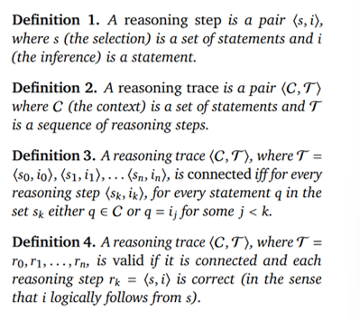
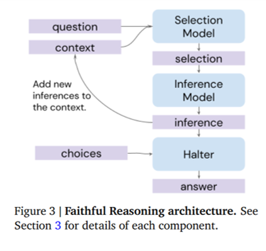
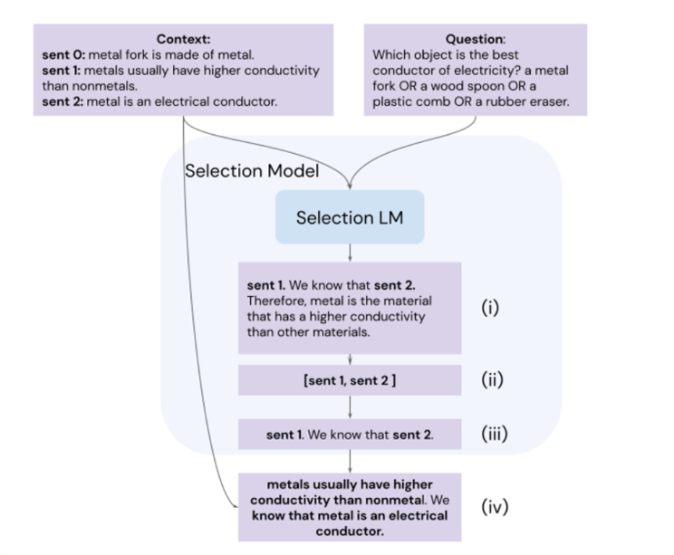

<head>

</head>
<head>
    
    
</head>

- [0. Abstract](#0-abstract)
  - [QA task, flaws of language models](#qa-task-flaws-of-language-models)
  - [to address the limitation...](#to-address-the-limitation)
  - [advantage of the method](#advantage-of-the-method)
- [1. Introduction](#1-introduction)
  - [flaws of LM in QA task](#flaws-of-lm-in-qa-task)
  - [faithful reasoning](#faithful-reasoning)
  - [model description](#model-description)
- [2. Defining a Valid Reasoning Trace](#2-defining-a-valid-reasoning-trace)
- [3. Components of a Faithful Reasoning Model](#3-components-of-a-faithful-reasoning-model)
  - [3.1 SI](#31-si)
    - [3.1.1 Selection](#311-selection)
    - [3.1.2 Inference](#312-inference)
  - [3.2 Halting: when to stop reasoning?](#32-halting-when-to-stop-reasoning)
    - [two-stage Halter](#two-stage-halter)
  - [3.3 Search: Finding the Best Trace](#33-search-finding-the-best-trace)
- [4. Experimental Setup and Evaluation of Components](#4-experimental-setup-and-evaluation-of-components)

# 0. Abstract
## QA task, flaws of language models
* opacity(不透明) --> compromise performance
  especially multi-step
## to address the limitation...
* chaining together reasoning steps
* each step results from **calls to two fine-tuned LMs**:
  selection + inference
## advantage of the method
* outperform baseline on **multi-step logical deduction** and **scientific question-answering**
  dataset: Proof Writer & question-answering version of EntailmentBank

* generates humanly interpretable reasoning traces --> **checkable**

# 1. Introduction
## flaws of LM in QA task
* unacceptable opacity

## faithful reasoning
* underlying computations mirror standard definitions of logical validity
* advanatage: checkable
* necessity:
  * 不知道它是从前置知识中得到的答案还是从relevant context中得到的答案
  * 前置知识中有很多bias：trained on human data collected from the internet

## model description
* forward-chaining
* backbone: selection & inference **(SI)**
  causal structure in between
* $+$ two further fine-tuned language models
  * the *halter*
    **terminate** the reasoning process and return an **answer in the required format**
  * a learned value function
    assesses the quality of the current reasoning step --> guide a beam search over reasoning traces

# 2. Defining a Valid Reasoning Trace

* reasoning step <selection,interference>
* reasoning trace <context, sequence of reasoning steps>
* reasoning trace **connected**: iff 对所有$s_k$,其中句子是出现过的$i_j$或在C中
* reasoning trace **valid**: connected & 每一步<$s_k,i_k$>都对

# 3. Components of a Faithful Reasoning Model
* SI
* the halt(generating answer)
**notice:** When there is sufficient information, the model predicts the answer in such a way that it cannot rely on knowledge embedded in its weights, but must depend on the reasoning trace.
## 3.1 SI
对一下架构做iteration，最后一次的inference用来输入halter

### 3.1.1 Selection
selection LM: training an LM to refer to statements in the context by their sentence labels

### 3.1.2 Inference
assumption: the Inference model produces logically correct inferences

## 3.2 Halting: when to stop reasoning?
* SI 不知道怎么停
* final inference 形式不 formal
### two-stage Halter
1. given the question and the final inference, if the question can be answered
2. if the question can be answered, use the same LM to generate the answer

如果超过一定的iteration仍然没有得到最终结果，就判定为'unknown'。最终的实验结果把那些判定为unknown的都去掉了。
inference的方向比较随机，没有定向，直觉上会产生很多的unknown question

## 3.3 Search: Finding the Best Trace
* value function (a language model LM$_{value}$): compute the value of adding a reasoning step to the current trace
* correct: ia both logically valid and is on the ground truth
* --> SI generate p candidate steps --> keep top b candidates according to LM$_{value}$ --> generate the next step candidates --> b * p traces

# 4. Experimental Setup and Evaluation of Components
