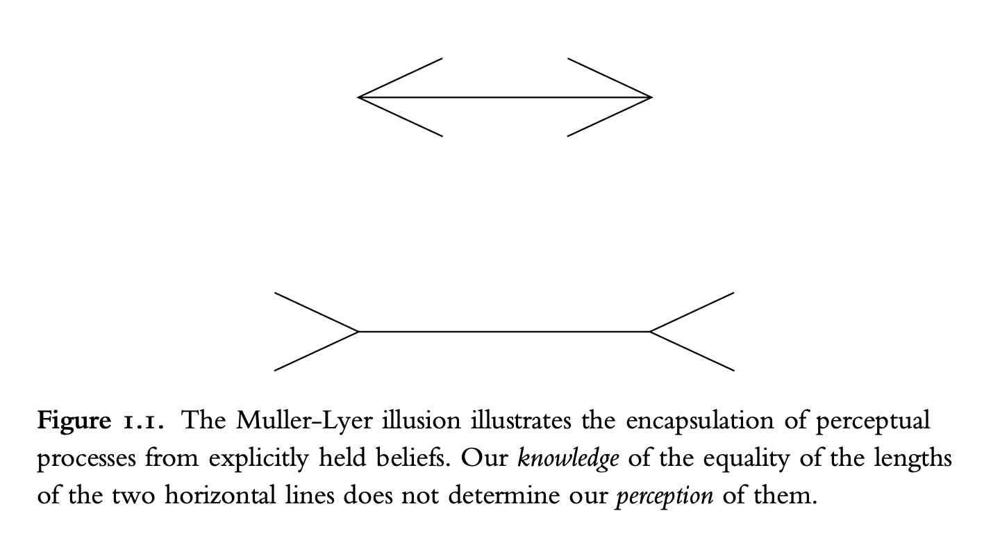

# Reading Notes of "The Origin of Concepts"
## 1. Some Preliminaries

Human beings possess rich conceptual understanding of the world. We can understand the conceptual representation process over three different time courses:

1. idividual learning
2. historical / cultural construction
3. evolution

> Some concepts, such as **object and number**, arise in some form over **evolutionary time**. Other concepts, such as **kayak, fraction, and gene**, spring from **human cultures**, and the construction process must be understood in terms of **both human individuals’ learning mechanisms and sociocultural processes**. Humans create complex artifacts, as well as religious, political, and scientific institutions, that themselves become part of the process by which further representational resources are created.

Different concepts may have different process of constructions; the construction of the concepts of causality, human agency, mathematical or biological concepts should be answered ***case by case***.

This books develops several case studies: the concepts *object*, *intentional agent, cause, integer, rational number,* and *matter, weight, and density.*

**What are "concepts"?** Concepts are mental representations. Concepts make up only part of our mental representations, meaning there are other mental representations than concepts.

The books three major theses:

>  *First major thesis*: there are two types of conceptual representations: those embedded in systems of core cognition and those embedded in explicit knowledge systems, such as intuitive theories.

>  *Second major thesis*: new representational resources emerge in development—representational systems with more expressive power than those they are built from, as well as representational systems that are incommensurable with those they are built from. That is, conceptual development involves theoretically important discontinuities.

> *Third major thesis*: the bootstrapping processes that have been described in the literature on the history and philosophy of science underlie the construction of new representational resources in childhood as well.

### Concepts and Mental Representations
> Concepts are units of thought, the constituents of beliefs and theories, and those concepts that interest me here are roughly the grain of single lexical items.

本书所关注的concepts主要是单个lexical items所表示的那些，作者认为concepts是一种“mental representations”。而作者不会论证神经系统是如何产生一些symbolic content的。

关于conceptual content是如何决定的，作者认为包含诸多要素，可以分为两类：
1. causal mechanism that connect a mental representation to the entities in the world in its extension;
2. computational processes internal to the mind that determine how the representation functions in thought.

Mental representations 存在多种不同类型，认知科学面临的挑战之一便是厘清它们之间的原则性区别。事实上，conceptual development 领域的一些具有历史重要性的观点都假定，不同年龄的儿童所能运用的 mental representations 的类型会发生转变，而这种主张本身就预设了表征具有不同种类。我认为，不同类型的表征在起源、发展轨迹、概念角色类型以及外延决定机制上，可能存在具有理论意义的差异。Chap 2 将探讨一种关于婴儿心理生活的图景，该图景认为，婴儿心智所依据的表征，与那些掌握语言和理论能力的成年人的表征截然不同。
* James 有一个著名的观点，即婴儿的世界是"一个蓬勃、喧嚣的混沌整体"。
* Quine 提出，婴儿始于一个知觉相似性空间，通过后天学习，尤其是语言学习，这个空间会转变为一个以自然种类概念来组织表征的系统。
* Piaget 也提出，婴儿生命之初拥有的是一套感觉运动图式，直到两岁末才能获得真正意义上的**符号表征**。

James, Quine, Piaget的观点背后蕴含一个假设，**sensory representation** 和 **conceptual representations** 是一个“谱线”的两端。在 sensory 到 conceptual 的发展中，独属于人类的mental capacity蕴含其中。Chap 2 会说明，婴儿在最开始只有sensory/perceptual的representations，而conceptual representations是在之后才发展出来的。

> 验证这样的理论，我们需要回答的问题是：如何区分这两种representations：sensory/perceptual vs. conceptual。而这是很难的。

根据心理本质主义学说，我们的心智具有这样一种特性：我们假定（事实证明，这种假定通常是正确的，但并非必然）特定自然种类的个体拥有隐藏的本质，这种本质决定了它们的存在、它们的类别以及它们的表面属性。即便我们对该种类的本质属性一无所知，我们仍会做出这样的假定。

In sum, there are many causal processes that are involved in connecting representations in a mind to their referents, and these are likely to **differ systematically for sensory/perceptual representations and conceptual representations**。无论推论角色在内容确定中是否起作用，perceptual representations 与 conceptual representations 在 inferential roles 的诸多方面存在差异：
* 感官/知觉表征相较于概念具有不同且更为贫乏的推论角色：它们表征此时此地的直接经验，而"某物是红色的"这一事实几乎无法推导出其他结论；
* 反之，将某物识别为"动因"或确定其构成物质，则会引发丰富的推论。Conceptual representations 嵌入于支持这种丰富推论角色的概念结构之中，它们构建因果解释框架，并与其他概念表征相互整合。

哲学家Jerry Fodor：
* distinguish between modular input analyzers and central processes. 
* perceptual representation是模块性的；而conceptual representation是central的：For the most part, sensory/perceptual processes are modular and conceptual processes are central. Modular processes are data driven, automatic, fast, and encapsulated.
* 以常见缪勒-莱耶错觉图为例，即便你知道两条水平线段实际等长，仍会感觉下边那条更长——你的perceptual representation 屏蔽了关于真实长度的 conceptual representation。与模块化过程相对，中央处理过程则具有信息开放性，任何信息都可能与特定假设相关，我们追求所有明确持有信念之间的融贯性。
* 福多对知觉表征（模块化输入装置的输出）与概念表征（与其他所有概念表征存在推论性关联）所作的过程性区分之所以重要，是因为它揭示了一种可能性：某些表面上看似并非感官/知觉的表征，在模块性方面却可能表现出与之相同的模式。他举的例子是句法表征。他认为，输出诸如名词短语、动词短语等抽象语言学表征的句法解析过程是模块化的，因此这类表征更接近感官/知觉表征，而非概念表征。

        

### Thesis I: Core Cognition 
阅读进度：(21/609)

## 2. The Initial Representational Repertoire: The Empiricist Picture

## 3. Core Object Cognition

## 4. Core Cognition: Number

## 5. Core Cognition: Agency

## 6. Representations of *Cause*
